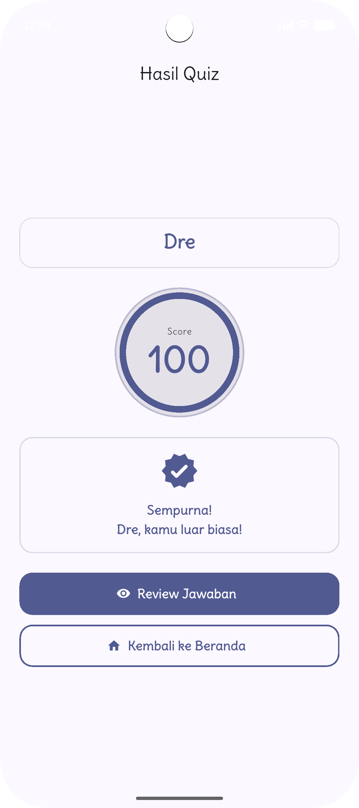
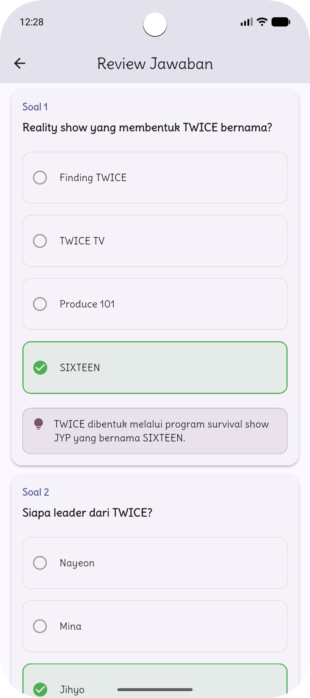
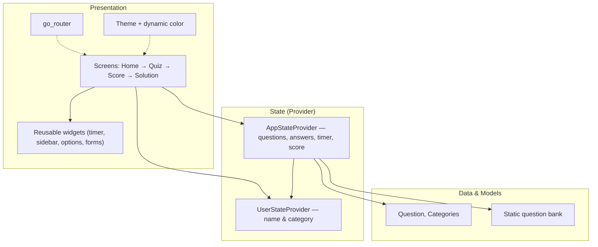

<div align="center">

# Capek Mikir 🧠❓

**A clean, responsive Flutter quiz app — pick a category, beat the timer, then review every answer with explanations.**

[](https://flutter.dev/)
[](https://dart.dev/)
[](https://pub.dev/packages/provider)
[](https://pub.dev/packages/go_router)
[](https://m3.material.io/)
[](./LICENSE)

</div>

Capek Mikir is a lightweight **quiz application built with Flutter**. Players enter
their name, choose a category, and answer 10 randomly drawn questions against a
countdown timer. When time runs out (or all questions are answered), the app
scores the session and lets the player review each question alongside the correct
solution and an explanation. It runs from a single codebase across mobile,
desktop, and the web, with an adaptive layout and Material 3 dynamic theming.

---

## Table of Contents

- [Overview](#overview)
- [Features](#features)
- [Screenshots & Demo](#screenshots--demo)
- [Tech Stack](#tech-stack)
- [Architecture](#architecture)
- [How It Works](#how-it-works)
- [Project Structure](#project-structure)
- [Getting Started](#getting-started)
  - [Prerequisites](#prerequisites)
  - [Run](#run)
  - [Build](#build)
- [CI/CD](#cicd)
- [License](#license)

---

## Overview

Capek Mikir keeps the quiz experience simple and focused. Each session pulls a
fresh, shuffled set of questions (and shuffles the answer choices too), so no two
plays feel the same. A three-minute timer adds a bit of pressure, and the
post-quiz solution view turns every mistake into a learning moment with built-in
explanations.

The app is fully responsive: the quiz and solution screens switch between a
**compact** layout for narrow screens and an **expanded** layout (with a question
sidebar) for wider ones. It also embraces Material 3 — following the system
light/dark mode and adopting **dynamic color** from the device wallpaper where
supported.

## Features

| Feature | Description |
|---|---|
| **🗂️ Category-based quizzes** | Choose from several categories before starting a session. |
| **🎲 Randomized questions** | Each session draws **10 random questions**, with answer choices shuffled too. |
| **⏱️ Timed sessions** | A **3-minute** countdown auto-submits the quiz when time runs out. |
| **📊 Score & solution review** | See your score, then review every question with the correct answer and an explanation. |
| **📱 Responsive layout** | Quiz and solution screens adapt between compact (narrow) and expanded (wide) views. |
| **🌓 Light & dark theme** | Automatically follows the device's system theme. |
| **🎨 Dynamic color** | Material 3 color scheme adapts to the user's wallpaper (where supported). |
| **🖥️ Multiplatform** | One codebase for Android, iOS, Web, Linux, macOS, and Windows. |

## Screenshots & Demo

### Home

<div align="center">

</div>

### Quiz (responsive)

| Compact (narrow screens) | Expanded (wide screens) |
|:---:|:---:|
|  |  |

### Score

<div align="center">

</div>

### Solution (responsive)

| Compact (narrow screens) | Expanded (wide screens) |
|:---:|:---:|
|  |  |

### Video demo

<div align="center">

<br>
<i>The preview above is a GIF — for the full video with sound, see the link below.</i>
<br>
<a href="docs/demo.mp4"><b>▶ Watch the full demo (MP4)</b></a>
</div>

## Tech Stack

- **Flutter** (Dart SDK `^3.9.2`) — cross-platform UI framework.
- **Provider** — state management via `ChangeNotifier` (`UserStateProvider`, `AppStateProvider`).
- **go_router** — declarative, named-route navigation (Home, Quiz, Score, Solution).
- **google_fonts** — typography, with the bundled **Delius** font asset.
- **dynamic_color** — Material 3 dynamic color schemes derived from the system/wallpaper.
- **Material 3** — theming, light/dark mode, and adaptive components.

## Architecture

Capek Mikir follows a simple, layered structure. The UI (**screens** and reusable
**widgets**) observes **providers** that hold all quiz and user state, while
**models** and a static **data** source define the questions. Routing is
centralized with go_router and theming lives in a dedicated config layer.



## How It Works

1. **Home** — the player enters a name and selects a category (`UserStateProvider` stores both).
2. **Start** — `AppStateProvider` loads the category's question bank, shuffles it, takes **10 questions**, shuffles each question's choices, and starts the **3-minute timer**.
3. **Quiz** — the player navigates between questions (next/previous or via the sidebar on wide screens) and selects answers; selections are tracked per question.
4. **Scoring** — when the timer hits zero or the quiz is submitted, the app compares answers to the correct solutions and computes the score.
5. **Solution** — the player reviews each question with the correct answer highlighted and an explanation shown.

## Project Structure

A high-level view of the `lib/` directory:

```text
lib/
├─ config/      # App theme & go_router configuration
├─ data/        # Static quiz question bank
├─ models/      # Question & category models
├─ provider/    # Provider state (user + quiz/app state)
├─ screens/     # Home, Quiz, Score, Solution screens
├─ widgets/     # Reusable UI components
└─ main.dart    # App entry point (theming, providers, router)
```

Platform runners for Android, iOS, Web, Linux, macOS, and Windows live in their
respective top-level folders, with shared assets (fonts) under `assets/`.

## Getting Started

### Prerequisites

- **Flutter SDK** installed and configured (Dart SDK `^3.9.2`).
- A target device or emulator (mobile, desktop, or a browser).

### Run

```bash
# Clone the repository
git clone https://github.com/andreasmlbngaol/capek-mikir.git
cd capek-mikir

# Install dependencies
flutter pub get

# Run on your selected device
flutter run
```

### Build

```bash
flutter build apk        # Android
flutter build ios        # iOS
flutter build web        # Web
flutter build linux      # Linux
flutter build macos      # macOS
flutter build windows    # Windows
```

## CI/CD

The project includes a **GitHub Actions** workflow
(`.github/workflows/deploy.yml`) that, on every push to `master` (ignoring
docs-only and README changes):

- sets up the **Flutter** SDK (stable channel),
- installs dependencies and builds the release **Flutter Web** bundle (`flutter build web --release`), and
- deploys the build output to a server over SSH/SCP.

## License

This project is licensed under the **MIT License** — see the [LICENSE](./LICENSE)
file for details.

© 2025 andreasmlbngaol
